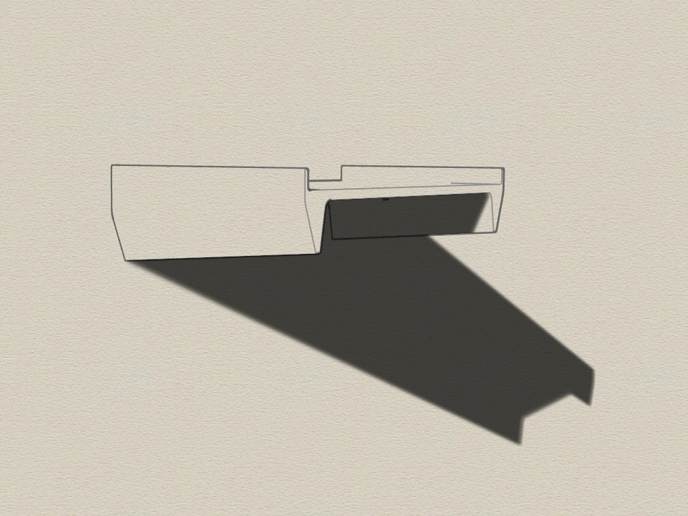
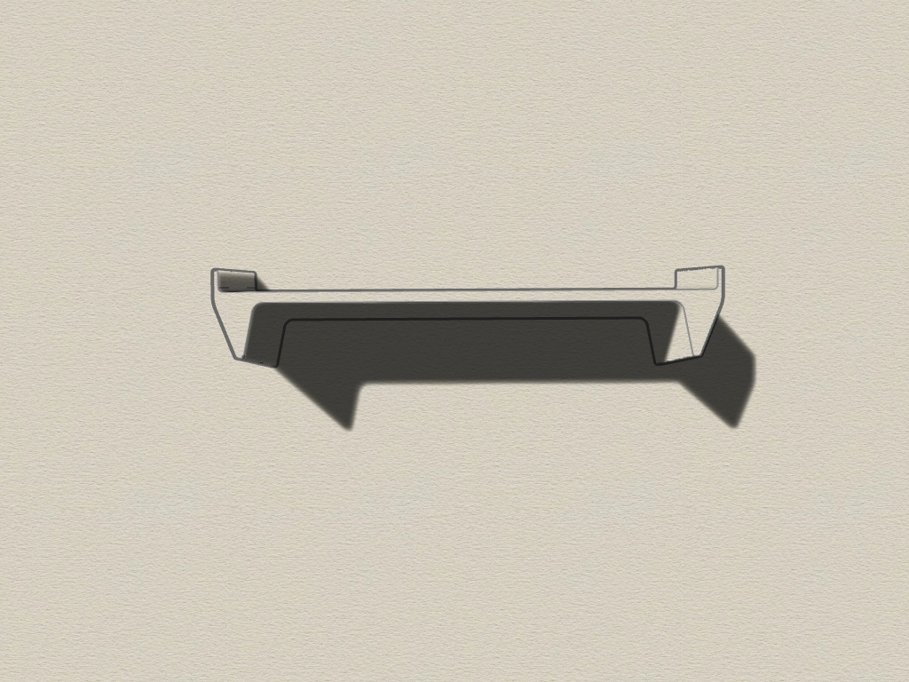
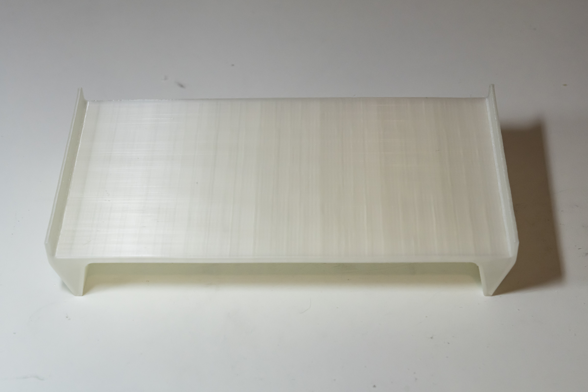
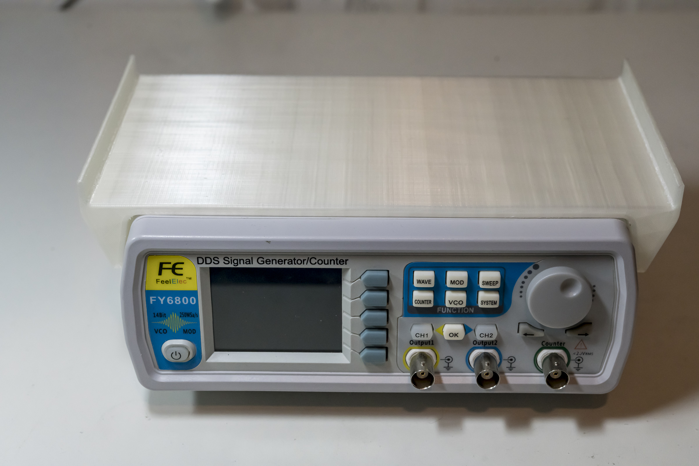
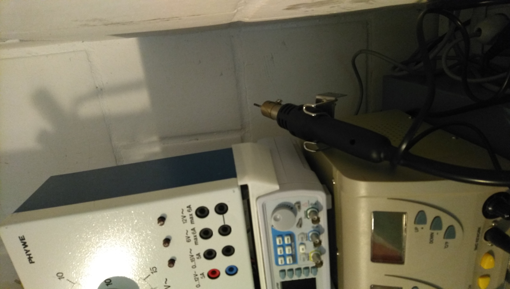

# FY6800-topmount
3D printable topmount for FY6800 signal generator. Created with Rhino 6.

## Tool
It often happens that you have to stack devices on top of each other because you have little space. The devices have different dimensions and do not always fit on top of each other. Or the housings are slightly slanted. 

That's what this part is designed for. It fits exactly on a FY6800 signal generator and compensates its inclination.

Requirements:
* 3D printer 
* Filament of your choice

## View

